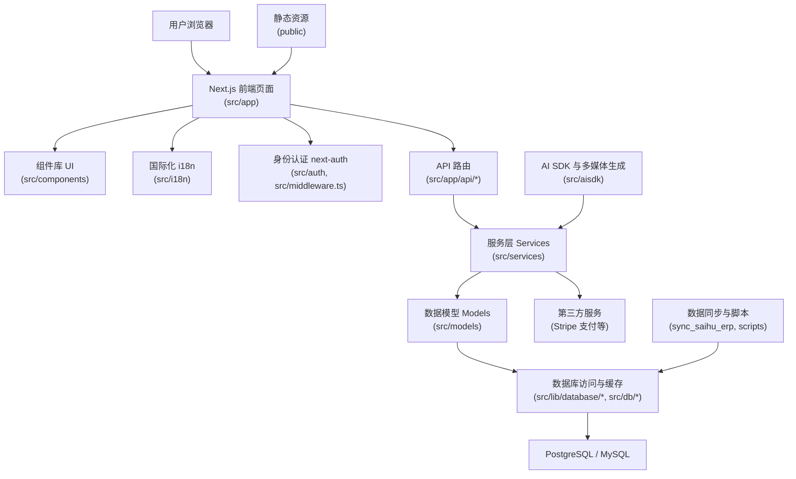
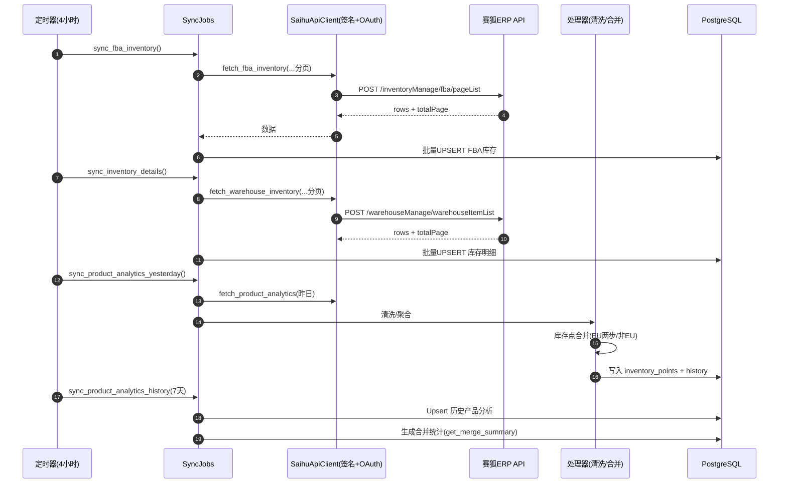
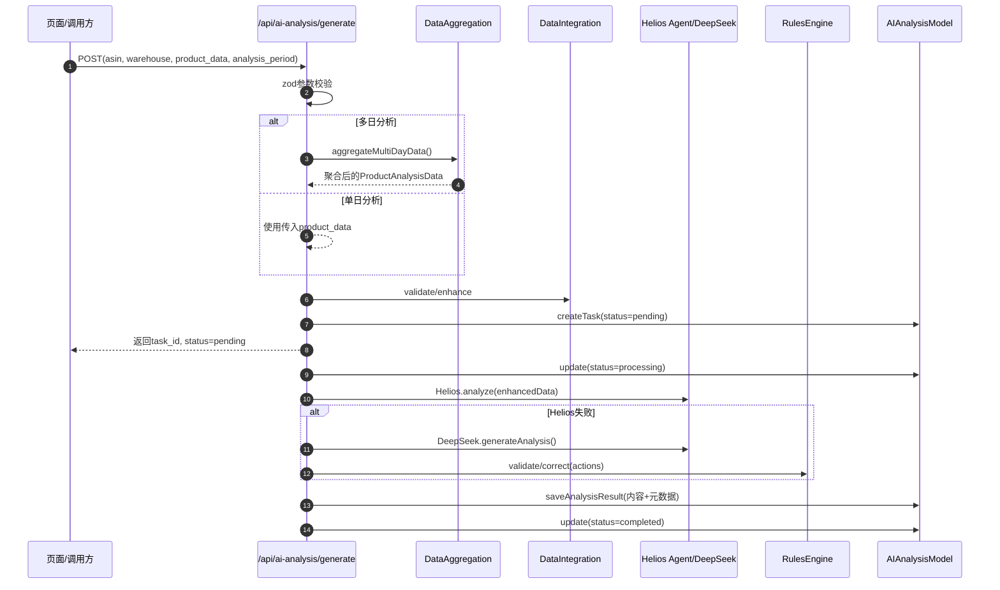

# 项目架构与代码结构总览（非技术同学友好版）

本文用非技术视角介绍本项目如何从“页面 → 接口 → 服务 → 数据”，以及每个目录的职责，帮助你在不知道代码细节的情况下，也能快速找到想要的信息。

---

## 顶层架构图（从用户到数据库）

可以把系统想象成一座商店：
- 前台（页面与组件）接待用户；
- 服务台（API + 服务层）受理请求；
- 仓库与账本（数据库与模型）存取数据；
- 收银台（Stripe）处理支付；
- 标识牌（i18n）负责多语言；
- 同步员（同步脚本）定期搬运外部数据进来。

---

## 顶层文件与目录（项目入口）

- `package.json`: 依赖与启动命令清单。
- `Dockerfile`: 容器化部署说明。
- `ENVIRONMENT_SETUP.md` / `set_up.md`: 本地运行、环境配置说明。
- `manage_postgres.sh`: 本地一键管理 PostgreSQL 的脚本。
- `vercel.json`: Vercel 部署相关配置。
- `public/`: 静态资源（图片、图标）。
- `scripts/`: 迁移与运维脚本（如迁移到 PostgreSQL）。
- `sync_saihu_erp/`: 独立的数据同步程序（Python），定时抓取外部系统数据并写入数据库。

---

## src/ 目录（核心应用）

### 1) `src/app/` 前端页面与 API 接口
- `src/app/[locale]/...`: 按语言（如 `en`/`zh`）组织的页面（App Router）。
- `src/app/api/...`: 后端接口（API 路由），接收前端请求。
- `src/app/layout.tsx` / `globals.css` / `theme.css`: 全局布局与样式。
- 常见业务入口：
  - `api/checkout`: 发起支付
  - `api/stripe-notify`: 支付回调（Stripe 通知）
  - `api/ai-analysis`: AI 分析功能接口
  - `api/inventory`: 库存/报表数据接口

### 2) `src/components/` 可复用的“前台组件库”
- `ui/`: 基础组件（按钮、表单、弹窗等，基于 Shadcn UI + Tailwind）。
- `blocks/`: 页面区块（页头、页脚、价格卡片、数据表等）。
- 业务组件：如 `ad-data/`、`inventory/`、`ai-analysis/` 等。

### 3) `src/i18n/` 多语言管理
- `messages/`: 全局词条（`en.json`、`zh.json`）。
- `pages/`: 针对具体页面的词条包。
- `navigation.ts`: 多语言路由导航支持。

### 4) `src/auth/` 身份认证
- 基于 `next-auth` 的登录与会话管理，配合 `src/middleware.ts` 实现受保护页面。

### 5) `src/services/` 业务服务层
- 真正的业务编排：承接 API → 调用模型/数据库/第三方服务（如 Stripe、AI）。

### 6) `src/models/` 业务领域模型
- 统一定义业务对象与核心规则（如用户、邀请码、AI 分析记录等）。

### 7) `src/lib/` 通用能力与外部链接
- `database/`: 数据访问与缓存（DAO、连接、缓存管理）。
- `adapters/`: 外部数据格式适配与转换。
- `utils/`: 日志、请求校验等工具。

### 8) `src/db/` 数据库与迁移
- `migrations/`: 数据库结构的历史变更记录（可追溯）。
- `config.ts`: 数据库连接配置。

### 9) `src/aisdk/` AI 能力封装
- 与生成式 AI/多媒体（如视频、图像）相关的调用封装，供服务层使用。

### 10) `src/contexts/` 与 `src/providers/`
- 跨页面共享状态（如主题）与应用级 Provider。

### 11) `src/types/`
- TypeScript 类型定义，保证各层数据结构一致、清晰。

### 12) `src/hooks/`
- 可复用的小逻辑积木（如移动端检测、分析历史读取）。

---

## 典型用户流程（业务怎么走）

### 登录
1. 用户打开页面 → 选择语言 → 点击登录；
2. `next-auth` 处理登录，`middleware.ts` 保护需要登录的页面；
3. 登录成功后，前端能够获取用户信息与权限。

### 查看数据报表（库存/广告等）
1. 页面组件发起请求 → `src/app/api/inventory/...`；
2. API 调用 `src/services/...` 的业务逻辑；
3. 服务层通过 `src/lib/database/...` 读取数据库；
4. 返回整理后的数据 → 页面展示图表与表格。

### 发起支付（升级套餐/购买点数）
1. 页面调用 `api/checkout` 获取支付会话；
2. 跳转 Stripe 完成支付；
3. Stripe 回调 `api/stripe-notify`；
4. 服务层更新数据库（额度/订单）→ 页面显示“支付成功”。

### AI 分析
1. 用户上传/选择数据 → 调用 `api/ai-analysis`；
2. 服务层编排 `src/aisdk` 与数据库；
3. 返回分析结果 → 前端组件可视化显示。

### 数据同步（外部 ERP → 本系统）
1. `sync_saihu_erp/` 定时运行，抓取/清洗外部系统数据；
2. 按 `src/db/migrations` 定义的结构写入数据库；
3. 前端再次查询即可看到最新数据。

---

## 常用“去哪里找”速查
- 页面文案/布局：`src/app/[locale]/*`（页面） + `src/components/*`（组件）
- 多语言词条：`src/i18n/messages/*.json` 与 `src/i18n/pages/*` 
- 接口（API）：`src/app/api/*`
- 业务逻辑：`src/services/*`
- 数据库结构/变更：`src/db/migrations/*`
- 支付相关：`api/checkout` 与 `api/stripe-notify` 对应的服务层实现
- AI 相关：`src/aisdk/*` + `src/app/api/ai-analysis/*` + `src/services/ai-analysis.ts`
- 外部系统同步：`sync_saihu_erp/*`

---

## 项目约定与最佳实践（简要）
- 函数式组件为主，充分复用组件与逻辑。
- 优先使用服务端渲染（SSR）与服务端组件（RSC）以提升性能。
- 样式统一用 Tailwind，复杂交互使用 Shadcn UI。
- 多语言统一管理在 `src/i18n/`，避免分散难以维护。
- API 只做“对外窗口”，核心业务在 `src/services/`，数据结构在 `src/models/`，数据库细节在 `src/lib/database/`。
- 安全、支付、日志、校验均有明确分层，便于排查与扩展。

---

如需进一步细化到某个功能（例如库存报表、广告分析、AI 工作流），可在以上目录中按“页面 → API → 服务 → 模型/数据库”的顺序逐层定位。

---

## 数据同步程序（`sync_saihu_erp/`）运行流程

- 目标与产出
  - 从赛狐 ERP（Sellfox）获取三类核心数据：产品分析、FBA 库存、库存明细。
  - 将原始数据清洗后写入 PostgreSQL，并按“欧盟两步合并/非欧盟直接合并”的规则生成“库存点”视图与历史快照。

- 触发方式
  - 一次性拉取：`python sync_saihu_erp/data_update/final_sync.py`
    - 使用 OAuth 获取访问令牌，分页拉取“近 7 天产品分析 + 昨日 FBA 库存/库存明细”，输出 JSON 结果，便于验收与离线分析。
  - 连续同步（每 4 小时）：`python sync_saihu_erp/data_update/continuous_sync_4hours.py`
    - 顺序：FBA 库存 → 库存明细 → 昨日产品分析（并做库存点合并）→ 更新近 7 天产品分析 → 生成当日合并统计 → 休眠 4 小时循环。
  - 调度作业封装：`data_update/src/scheduler/sync_jobs.py` 提供可复用的单项任务（抓取/处理/持久化/统计）。

- 核心组件
  - 配置：`data_update/config/config.yml`（数据库、API 基址与超时、重试与节流、批大小、历史天数）。
  - 认证与签名：
    - OAuth 客户端：`data_update/src/auth/oauth_client.py` 获取 `access_token`。
    - 请求签名：`data_update/src/auth/api_signer.py` 基于 HMAC-SHA256 生成签名参数。
    - API 客户端：`data_update/src/auth/saihu_api_client.py` 组合 Token+签名发起请求，支持分页获取。
    - 安全客户端：`data_update/src/services/secure_api_client.py` 提供重试、指数回退、限流处理（429/503）。
  - 抓取层（Scrapers）：
    - `product_analytics_scraper.py` / `fba_inventory_scraper.py` / `inventory_details_scraper.py` 分页抓取数据，统一返回结构。
  - 处理层（Processors）：
    - `product_analytics_processor.py` 清洗/聚合/衍生指标（CTR/CVR/RPC/ACOS 等），对“昨日 + 近 7 天”分别做新增/更新。
    - `inventory_merge_processor.py` 调用 `inventory.InventoryMerger` 执行欧盟两步合并与非欧盟合并，计算周转天数、有效库存点、断货等指标，落库 `inventory_points` 与 `inventory_point_history`，并提供 `get_merge_summary`。
  - 数据库层：
    - `data_update/src/database/postgresql_connection.py`（或 `connection.py`）封装连接池/事务/批量写入；批量 UPSERT `product_analytics`、`fba_inventory`、`inventory_details`。
    - 初始化 SQL：`sync_saihu_erp/data_update/sql/postgresql_init.sql` 等。
  - 调度与编排：
    - `continuous_sync_4hours.py` 通过 `SyncJobs` 组织任务，记录日志，检查表数据量并输出摘要。
  - 通知与状态：
    - `data_update/src/services/sync_notifier.py` 可向 Web 系统 `api/rpa/status` 上报“开始/进度/完成/错误”等状态（可选）。

- 端到端时序（每 4 小时巡检一次）

- 错误处理与鲁棒性
  - API 失败/限流：自动延迟与指数回退重试；分页中断会记录并继续后续任务。
  - 数据质量：严格字段校验与标准化，异常项跳过且写日志；聚合时做边界防护（除零、空值）。
  - 数据一致性：同一主键使用 UPSERT，昨日与近 7 天分开处理，避免重复与冲突。

- 与 Web 系统的关系
  - 同步产出的表被 Next.js 应用通过 `src/lib/database/*` 读用，驱动报表与看板。
  - 可选的状态回传接口：`/api/rpa/status` 接收同步状态，用于前端提示或运维监控。

- 快速开始（同步程序）
  1. 准备数据库：确保 PostgreSQL 可用，并执行初始化脚本（见 `sync_saihu_erp/data_update/sql/postgresql_init.sql`）。
  2. 配置凭据与参数：编辑 `sync_saihu_erp/data_update/config/config.yml`，将 API 基址、超时、重试、批大小、历史天数等参数调整为实际环境；OAuth 凭据放置于安全配置/环境变量中。
  3. 本地试跑一次性拉取：`python sync_saihu_erp/data_update/final_sync.py`（用于验证连通性与数据格式）。
  4. 启动连续同步：`python sync_saihu_erp/data_update/continuous_sync_4hours.py`（控制台会输出每轮成功/失败统计）。
  5. 验证前端：刷新报表页面，确认最新数据已呈现；如启用状态通知，检查 `/api/rpa/status` 接口接收情况。

---

## AI 分析（`src/app/api/ai-analysis`）运行流程

- 核心目标
  - 将库存/销售/广告关键指标标准化，调用智能体生成“分析+行动”，并落库为可追溯的任务记录。

- 主要端点
  - `GET /api/ai-analysis`：查询任务列表（分页、筛选、排序），返回任务与解析后的 `product_data`。
  - `POST /api/ai-analysis`：执行动作汇总（`stats`）、获取最新一条（`latest`）、查询历史（`history`）、清理旧任务（`cleanup`）。
  - `POST /api/ai-analysis/generate`：创建单条分析任务（支持“多日聚合”）。
  - `POST /api/ai-analysis/batch`：批量创建分析任务（Excel/表格数据→标准化→批量调度）。
  - `GET|PUT|DELETE /api/ai-analysis/[id]`：查看/评价/删除单个任务。
  - `POST /api/ai-analysis/stream`：SSE 流式输出逐步分析进度与最终内容。

- 数据准备与校验
  - 请求体验证：`zod` 在各路由中校验参数与 `product_data` 必填/范围。
  - 数据聚合：`services/data-aggregation.ts`
    - 从 PostgreSQL（`PostgreSQLAdapter`）按 ASIN、库存点与时间窗获取 `inventory_points` 历史；
    - 提供聚合方法：`latest`（取最近）、`average`（均值）、`sum`（累积/日均）、`trend`（近期加权）；
    - 计算趋势与数据质量（缺失天数、完整度分级）。
  - 数据集成：`services/data-integration.ts`
    - 将库存点/Excel数据转换为标准 `ProductAnalysisData`；
    - 校验一致性（如广告点击≤曝光，分项库存和=总库存）；
    - `enhanceAnalysisData` 计算 CTR/CVR/标准CVR/ACOAS/健康度标签。

- 智能体与回退
  - 首选智能体：`agents/helios-agent.ts`（LangGraph）
    - 图节点：数据验证 → 库存分析 → 广告分析 → 销售分析 → 综合诊断 → 行动生成 → 规则验证 → 输出格式化；
    - 诊断场景：库存不足/转化不足/广告不足/库存积压/广告成本高/运营健康；对应生成行动清单（补货、促销、BID 调整等）。
  - 回退策略：若 Helios 失败，降级到 `getAnalysisService().generateAnalysis`（DeepSeek 类服务）。

- 业务规则校验
  - `engines/rules-engine.ts`：内置多条强制/建议规则（如 ACOAS>25% 必须降 BID、节日品不补货、Coupon≤20% 等）。
  - 回退场景下对生成的“行动”做校验与自动纠偏，输出合规版行动清单与合规摘要。

- 任务生命周期与存储
  - 模型：`AIAnalysisModel`（查询/创建/更新状态/保存结果/清理）；
  - 状态：`pending → processing → completed/failed`；
  - 结果：保存分析内容、耗时、令牌使用、方法（helios/deepseek）、批次等元数据。

- 批量与流式
  - 批量：`/batch`
    - 将 Excel/表格数据转 `ProductData` → 库存点计算 → `ProductAnalysisData`；可按规则过滤优先产品；
    - 逐个创建任务并用 Helios 执行，限速避免频控；提供批次进度查询（完成数/失败数/百分比等）。
  - 流式：`/stream`
    - 校验后创建任务，`StreamingAnalysisService.streamAnalysis` 逐步产出事件（SSE）；完成时保存全文并关闭流。

- 端到端时序（单条生成 `/generate`）

- 使用建议
  - 单条分析：优先使用 `/generate`，必要时开启 `analysis_period` 做多日聚合；
  - 实时体验：使用 `/stream` 获取过程事件（适合前端逐步渲染）；
  - 批量分析：用 `/batch` 输入产品清单并设置筛选条件，后台异步执行并查询批次进度。
