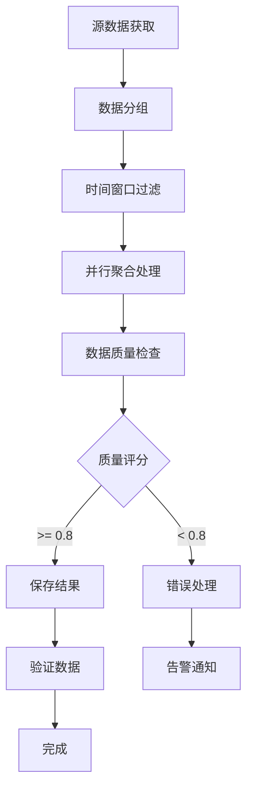

# 库存快照聚合系统设计文档

## 系统概览

基于现有 `product_analysis2` 表的库存快照聚合系统，用于生成多时间维度的库存分析报表。每日自动生成 T-1 日期的 4 种时间窗口快照数据，支持库存预警、销售趋势分析和广告效果评估。

### 核心特性

- **多时间维度**: T-1(1天)、T-3到T-1(3天)、T-7到T-1(7天)、T-30到T-1(30天)
- **智能聚合**: 库存取最新值，销售数据累加，广告指标重新计算
- **数据质量保障**: 完整的验证机制和自动修复
- **高性能**: 优化索引、分批处理、并行计算
- **自动化调度**: 每日自动执行，支持手动触发和补数据

## 数据架构设计

### 1. 源数据表 (product_analysis2)

基于现有 SQL Schema，包含以下关键字段：

```sql
-- 基础维度
asin VARCHAR(20) NOT NULL                    -- 产品ASIN
data_date DATE NOT NULL                      -- 数据日期
marketplace_id VARCHAR(50)                  -- 市场标识（warehouse_location）
dev_name VARCHAR(100)                       -- 业务员名称
spu_name VARCHAR(500)                       -- 产品名称

-- 库存数据
fba_inventory INTEGER DEFAULT 0             -- FBA可用库存
total_inventory INTEGER DEFAULT 0           -- 总库存

-- 销售数据
sales_amount DECIMAL(12,2) DEFAULT 0.00     -- 销售金额
sales_quantity INTEGER DEFAULT 0            -- 销售数量

-- 广告数据
impressions BIGINT DEFAULT 0                -- 广告曝光量
clicks INTEGER DEFAULT 0                    -- 广告点击量
ad_cost DECIMAL(12,2) DEFAULT 0.00         -- 广告花费
ad_orders INTEGER DEFAULT 0                 -- 广告订单量
```

### 2. 目标表 (inventory_deals)

完整的快照聚合结果存储表：

```typescript
export const inventoryDeals = pgTable("inventory_deals", {
  // 基础维度信息
  snapshot_date: date().notNull(),           // T-1 库存点日期
  asin: varchar({ length: 20 }).notNull(),
  product_name: varchar({ length: 500 }).notNull(),
  sales_person: varchar({ length: 100 }).notNull(),
  warehouse_location: varchar({ length: 50 }).notNull(),
  
  // 时间窗口标识
  time_window: varchar({ length: 10 }).notNull(),     // 'T1', 'T3', 'T7', 'T30'
  time_window_days: integer().notNull(),              // 1, 3, 7, 30
  window_start_date: date().notNull(),
  window_end_date: date().notNull(),
  
  // 库存数据（T-1最新值）
  fba_available: integer().notNull().default(0),
  fba_in_transit: integer().notNull().default(0),
  local_warehouse: integer().notNull().default(0),
  total_inventory: integer().notNull().default(0),
  
  // 销售数据（窗口累加）
  total_sales_amount: decimal({ precision: 12, scale: 2 }),
  total_sales_quantity: integer().notNull().default(0),
  avg_daily_sales: decimal({ precision: 10, scale: 2 }),
  avg_daily_revenue: decimal({ precision: 10, scale: 2 }),
  
  // 广告数据（累加 + 重新计算百分比）
  total_ad_impressions: bigint({ mode: 'number' }),
  total_ad_clicks: integer().notNull().default(0),
  total_ad_spend: decimal({ precision: 12, scale: 2 }),
  total_ad_orders: integer().notNull().default(0),
  ad_ctr: decimal({ precision: 8, scale: 6 }),           // 重新计算
  ad_conversion_rate: decimal({ precision: 8, scale: 6 }), // 重新计算
  acos: decimal({ precision: 8, scale: 6 }),              // 重新计算
  
  // 计算指标
  inventory_turnover_days: decimal({ precision: 10, scale: 2 }),
  inventory_status: varchar({ length: 20 }).default('正常'),
  
  // 元数据和审计字段
  source_records_count: integer().notNull().default(0),
  data_completeness_score: decimal({ precision: 3, scale: 2 }),
  batch_id: varchar({ length: 50 }),
  processing_duration_ms: integer(),
  created_at: timestamp({ withTimezone: true }).defaultNow(),
  updated_at: timestamp({ withTimezone: true }).defaultNow()
})
```

## 核心算法设计

### 1. 数据聚合逻辑

#### 时间窗口定义
```typescript
const TIME_WINDOWS = [
  { code: 'T1', days: 1, description: 'T-1 (1天)' },
  { code: 'T3', days: 3, description: 'T-3到T-1 (3天)' },
  { code: 'T7', days: 7, description: 'T-7到T-1 (7天)' },
  { code: 'T30', days: 30, description: 'T-30到T-1 (30天)' }
];
```

#### 关键聚合规则

**库存数据处理**:
- 始终取 T-1（最新一天）的库存值
- 所有时间窗口的库存数据保持一致

**销售数据处理**:
- 在时间窗口内直接累加
- 计算日均销量: `总销量 / 窗口天数`
- 计算日均销售额: `总销售额 / 窗口天数`

**广告百分比指标重新计算**:
```typescript
// CTR = 总点击量 / 总曝光量
const calculated_ctr = total_impressions > 0 
  ? total_clicks / total_impressions
  : 0;

// 转化率 = 总订单量 / 总点击量
const calculated_conversion_rate = total_clicks > 0
  ? total_orders / total_clicks 
  : 0;

// ACOS = 总广告花费 / 总广告销售额
const calculated_acos = total_ad_sales > 0 
  ? total_spend / total_ad_sales
  : 0;
```

### 2. 业务规则

#### 库存状态判定
```typescript
function calculateInventoryStatus(turnoverDays: number): string {
  if (turnoverDays <= 7) return '短缺';
  if (turnoverDays <= 30) return '正常';  
  if (turnoverDays <= 60) return '充足';
  return '积压';
}
```

#### 库存周转天数计算
```typescript
const inventory_turnover_days = avg_daily_sales > 0
  ? total_inventory / avg_daily_sales
  : 999.99; // 无销售时设为极大值
```

## ETL 流程设计

### 1. 调度策略

- **每日执行**: 02:00 自动执行前一天的快照生成
- **失败重试**: 每小时检查失败任务，最多重试 3 次
- **手动触发**: 支持指定日期的手动快照生成
- **批量补数据**: 支持日期范围的批量数据补齐

### 2. 数据处理流程



### 3. 性能优化策略

#### 索引设计
```sql
-- 主要聚合查询索引
CREATE INDEX idx_pa2_aggregation_primary 
ON product_analysis2 (asin, marketplace_id, data_date, dev_name);

-- 时间范围查询索引
CREATE INDEX idx_pa2_time_range 
ON product_analysis2 (data_date, asin, marketplace_id);

-- 库存数据查询索引
CREATE INDEX idx_pa2_inventory 
ON product_analysis2 (total_inventory, fba_inventory, data_date);
```

#### 分批处理配置
```typescript
const OPTIMIZATION_CONFIG = {
  batch_sizes: {
    source_data_fetch: 5000,      // 源数据获取批量
    aggregation_process: 1000,    // 聚合处理批量
    insert_batch: 500            // 插入操作批量
  },
  parallel_config: {
    max_concurrent_groups: 4,     // 最大并发处理组数
    connection_pool_size: 10      // 数据库连接池大小
  }
};
```

## 数据质量保障

### 1. 验证规则体系

#### 数据完整性验证
- 聚合结果与源数据一致性检查
- 时间窗口数据完整性验证
- 关键字段非空率检查

#### 业务逻辑验证
- 广告指标计算一致性（CTR、转化率、ACOS）
- 库存状态与周转天数一致性
- 销售数据合理性检查

#### 跨时间维度验证
- 累加逻辑一致性（长期窗口包含短期）
- 库存数据跨窗口一致性
- 时间窗口完整性检查

#### 异常检测
- 基于 Z-Score 的统计异常检测
- 极值检测和业务合理性检查
- 数据质量评分计算

### 2. 自动修复机制

支持自动修复的问题类型：
- 广告指标计算错误
- 日均销量计算错误  
- 库存状态判定错误

无法自动修复的问题会触发人工审核流程。

## API 接口设计

### 1. 手动触发快照生成

```http
POST /api/inventory-snapshot
Content-Type: application/json

{
  "action": "manual_snapshot",
  "target_date": "2024-08-10"
}
```

**响应示例**:
```json
{
  "success": true,
  "task_id": "manual_2024-08-10_1691234567890",
  "records_processed": 1250,
  "duration_ms": 45230,
  "data_quality_score": 0.95
}
```

### 2. 批量补数据

```http
POST /api/inventory-snapshot
Content-Type: application/json

{
  "action": "backfill", 
  "start_date": "2024-08-05",
  "end_date": "2024-08-10"
}
```

### 3. 查询任务状态

```http
GET /api/inventory-snapshot?task_id=manual_2024-08-10_1691234567890
```

## 业务使用场景

### 1. 库存预警分析

查询短缺库存产品：
```sql
SELECT asin, product_name, warehouse_location, 
       total_inventory, inventory_turnover_days
FROM inventory_deals
WHERE snapshot_date = CURRENT_DATE - 1
  AND time_window = 'T7'
  AND inventory_status = '短缺'
ORDER BY inventory_turnover_days ASC;
```

### 2. 销售趋势对比

对比不同时间窗口的销售表现：
```sql
SELECT asin, product_name,
  MAX(CASE WHEN time_window = 'T1' THEN avg_daily_sales END) as daily_1d,
  MAX(CASE WHEN time_window = 'T7' THEN avg_daily_sales END) as daily_7d,
  MAX(CASE WHEN time_window = 'T30' THEN avg_daily_sales END) as daily_30d
FROM inventory_deals
WHERE snapshot_date = CURRENT_DATE - 1
  AND warehouse_location = 'US'
GROUP BY asin, product_name;
```

### 3. 广告效果分析

分析 ACOS 表现最佳的产品：
```sql
SELECT asin, product_name, warehouse_location,
       total_ad_impressions, total_ad_clicks, total_ad_spend,
       ad_ctr, ad_conversion_rate, acos
FROM inventory_deals
WHERE snapshot_date = CURRENT_DATE - 1
  AND time_window = 'T30'
  AND total_ad_spend > 100
ORDER BY acos ASC;
```

## 部署和运维

### 1. 数据库迁移

```bash
# 生成迁移文件
pnpm db:generate

# 执行迁移
pnpm db:migrate
```

### 2. 系统初始化

```typescript
import { performanceOptimizer } from '@/lib/optimization/inventory-performance-optimizer';
import { snapshotScheduler } from '@/lib/etl/inventory-snapshot-scheduler';

// 创建优化索引
await performanceOptimizer.createOptimizedIndexes();

// 启动定时调度
snapshotScheduler.startScheduler();
```

### 3. 监控指标

- **处理性能**: 单日快照生成时间 < 5 分钟
- **数据质量**: 质量评分 >= 0.8
- **系统可靠性**: 成功率 >= 99%
- **资源使用**: 内存使用 < 2GB，CPU 使用 < 80%

### 4. 告警配置

- 任务执行失败立即告警
- 数据质量评分低于 0.7 告警
- 处理时间超过 10 分钟告警
- 库存短缺产品数量异常告警

## 扩展计划

### 短期优化 (1-2个月)
- 增加更多库存数据源（FBA在途、本地仓）
- 优化广告销售额计算逻辑
- 增加产品维度的趋势分析

### 中期规划 (3-6个月) 
- 实时快照更新（小时级别）
- 机器学习预测库存需求
- 多币种和汇率支持
- 移动端Dashboard

### 长期规划 (6个月以上)
- 跨平台数据整合（淘宝、京东等）
- 智能补货建议系统
- 供应链优化分析
- 国际化多语言支持

## 总结

本库存快照聚合系统提供了完整的数据处理、质量保障、性能优化和运维监控解决方案。通过多时间维度的智能聚合，为业务决策提供准确、及时的数据支持。

系统特点：
- **完整性**: 覆盖数据处理全链路
- **可靠性**: 多重验证和自动修复机制
- **高性能**: 优化索引和并行处理  
- **易扩展**: 模块化设计，便于功能扩展
- **易运维**: 完善的监控和告警机制