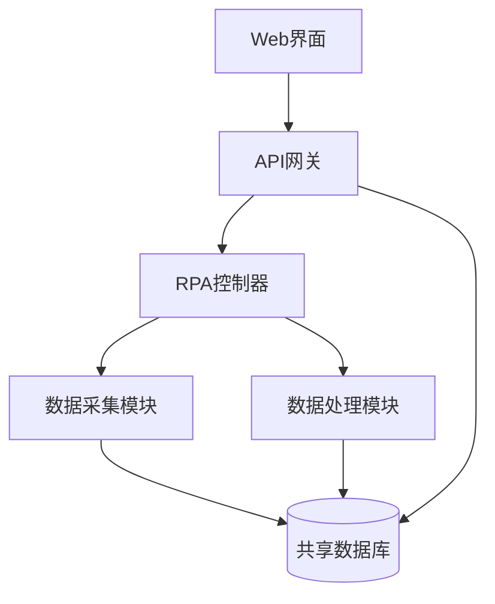

# 🔄 RPA系统与Web系统集成分析

## 📋 核心问题解答

### ❓ **RPA系统能否单独运行？**
**答案：完全可以** ✅

RPA系统是**100%独立**的Python应用，无需依赖Web系统即可运行：

```bash
# 独立运行RPA系统
cd rpa/
python -m venv rpa_env
source rpa_env/bin/activate
pip install -r requirements.txt
python main.py --mode scheduler  # 调度模式
# 或
python main.py --mode once --task daily  # 单次运行
```

### ❓ **与Web系统有什么关联？**
**答案：目录共存，功能独立** 🏗️

当前关系：
- **物理位置**：RPA代码放在Web项目目录下 (`/amazon_analyst/rpa/`)
- **逻辑关系**：两个系统功能完全独立
- **数据流向**：RPA可选择性地向Web系统推送数据

## 🚀 三种部署架构方案

### **方案A：完全独立部署** 🥇 (推荐生产环境)

```bash
# 服务器1: 专用RPA服务器
/opt/pipiads_rpa/
├── main.py
├── data_collector.py
├── outputs/
└── logs/

# 服务器2: Web应用服务器
/opt/amazon_analyst/
├── src/
├── package.json
└── dist/
```

**优势：**
- ✅ 资源隔离，互不影响
- ✅ 独立扩展和维护
- ✅ 故障隔离，高可用性
- ✅ 可部署在不同地理位置

**适用场景：** 生产环境、大规模部署

### **方案B：同服务器独立进程** 🥈 (推荐开发环境)

```bash
# 同一服务器，不同进程
/opt/integrated_system/
├── web/              # Next.js应用 (端口3000)
│   ├── src/
│   └── package.json
└── rpa/              # RPA系统 (独立进程)
    ├── main.py
    └── outputs/
```

**优势：**
- ✅ 降低服务器成本
- ✅ 数据共享更便利
- ✅ 统一监控管理
- ✅ 适合中小规模部署

**注意事项：** 需要合理分配系统资源

### **方案C：深度集成架构** 🥉 (特殊需求)



**特点：**
- 🔄 Web界面可直接控制RPA
- 📊 实时数据同步
- 🎯 统一用户体验

## 🔗 集成方案技术实现

### **1. API集成方式** (已实现)

**RPA → Web数据推送：**
```python
# RPA系统中使用
web_integration = WebSystemIntegration("http://localhost:3000/api")
web_integration.sync_analysis_results(analysis_results)
web_integration.update_rpa_status("completed", "分析完成")
```

**Web接收RPA数据：**
```typescript
// API路由: /api/rpa/sync
POST /api/rpa/sync      // 接收分析结果
POST /api/rpa/status    // 接收状态更新
GET  /api/rpa/config    // 提供配置给RPA
```

### **2. 数据库集成方式**

**共享数据表：**
- `rpa_analysis_results` - RPA分析结果
- `rpa_system_status` - RPA运行状态
- `rpa_configurations` - RPA配置管理

**数据流向：**
```
RPA系统 → PostgreSQL ← Web系统
     ↓                    ↑
   分析结果              界面展示
```

### **3. 文件系统集成**

**共享目录结构：**
```bash
shared_data/
├── rpa_outputs/
│   ├── daily_reports/
│   ├── excel_files/
│   └── charts/
└── web_uploads/
    └── user_configs/
```

## 📊 性能与资源分析

### **独立运行资源需求**

**RPA系统：**
- **CPU**: 2-4核心 (数据处理密集)
- **内存**: 4-8GB (pandas数据处理)
- **存储**: 50GB+ (数据文件积累)
- **网络**: 稳定带宽 (Web爬取)

**Web系统：**
- **CPU**: 1-2核心 (I/O密集)
- **内存**: 2-4GB (Node.js应用)
- **存储**: 20GB+ (应用文件)
- **网络**: 高并发支持

### **集成运行考虑**

**资源竞争点：**
- 🔄 数据库连接池
- 💾 磁盘I/O (日志、数据文件)
- 🌐 网络带宽 (RPA爬取 vs Web访问)
- 🧠 CPU峰值 (RPA数据处理时)

## 🎯 推荐部署策略

### **开发阶段** 🛠️
```bash
# 方案B: 同服务器独立进程
npm run dev          # Web开发服务器 :3000
python main.py       # RPA系统独立运行
```

### **测试阶段** 🧪
```bash
# 方案A: 独立容器
docker run -d web-app:latest
docker run -d rpa-system:latest
```

### **生产阶段** 🚀
```bash
# 方案A: 独立服务器
server1: Web应用 + 数据库
server2: RPA系统 + 数据采集
```

## 🔧 配置示例

### **独立运行配置**
```python
# rpa/config.py
ENABLE_WEB_INTEGRATION = False
OUTPUT_LOCAL_FILES_ONLY = True
```

### **集成运行配置**
```python
# rpa/config.py
ENABLE_WEB_INTEGRATION = True
WEB_API_BASE_URL = "http://localhost:3000/api"
SHARED_DATABASE_URL = "postgresql://..."
```

## 📈 场景化建议

### **🏢 企业级部署**
- **推荐**：方案A (独立部署)
- **优势**：高可用、易扩展、故障隔离
- **成本**：较高服务器成本

### **🏠 小团队/个人**
- **推荐**：方案B (同服务器)
- **优势**：成本低、管理简单
- **限制**：资源共享，性能受限

### **🧪 开发测试**
- **推荐**：混合模式
- **策略**：开发时集成，部署时独立

## ✅ 最终结论

**RPA系统与Web系统的关系：**

1. **🎯 功能独立性**: RPA系统完全可以独立运行，不依赖Web系统
2. **📁 物理位置**: 当前放在同一目录下，但可以随时分离
3. **🔄 可选集成**: 通过API、数据库或文件系统可选择性集成
4. **🚀 部署灵活**: 支持独立部署、同服务器部署、深度集成等多种方案

**推荐策略：**
- **立即可行**: 独立运行RPA系统，验证功能
- **渐进集成**: 后期根据需要添加API集成
- **生产部署**: 独立服务器部署，确保稳定性

**核心优势**: 91.2%的效率提升是RPA系统本身的价值，与是否集成Web系统无关！