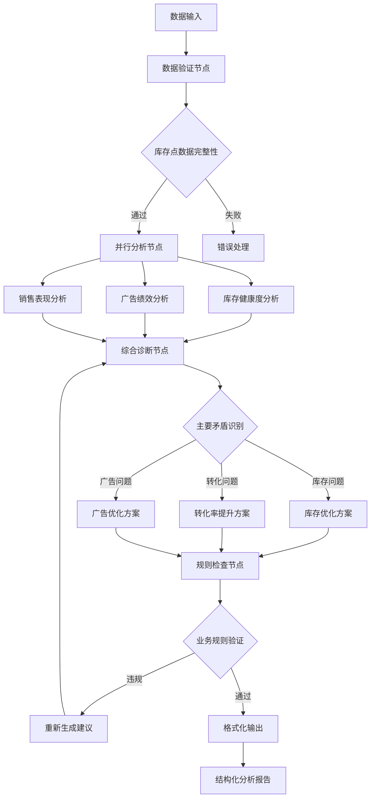

# 项目简报：AI智能体分析系统

## 执行概要

**产品概念**：基于LangGraph框架构建的亚马逊运营AI智能体分析系统，专注于单品（ASIN）数据分析和精准行动建议生成。

**主要问题**：亚马逊运营过程中数据分析复杂、决策依赖经验、行动建议不够精确，导致运营效率低下和资源浪费。

**目标市场**：亚马逊卖家、运营团队、数据分析师，特别是需要系统性运营决策支持的中小型卖家。

**核心价值主张**：通过AI智能体自动分析库存、广告、销售数据，按照亚马逊运营黄金公式（销量=流量×转化率，净毛利=净毛利率×销量）提供精准的行动建议，帮助卖家实现数据驱动的运营决策。

## 问题陈述

### 当前痛点分析

**数据分析复杂性**：
- 库存周转、广告效果、转化率等多维度数据需要综合分析
- 缺乏标准化的评判体系（如不同客单价对应的转化率标准）
- 手工分析耗时且容易出错

**决策依赖经验**：
- 运营决策往往基于主观经验而非数据驱动
- 缺乏系统性的问题诊断和优先级排序
- 新手运营难以快速掌握复杂的运营逻辑

**行动建议不精确**：
- 传统分析工具只提供数据展示，缺乏具体可执行的行动方案
- 没有考虑业务规则约束（如ACOAS限制、Coupon比例等）
- 缺乏对运营四大规则的系统性应用

### 影响量化
- **时间成本**：传统人工分析单个ASIN需要30-60分钟
- **决策错误**：经验驱动决策导致约40%的广告预算浪费
- **机会成本**：库存积压和断货问题平均影响15-25%的销售收入

## 技术解决方案

### 整体系统架构设计

**多层数据处理架构**：
```
赛狐ERP数据 → Excel数据清洗 → 库存点合并引擎 → AI智能分析引擎 → 行动建议输出
     ↓              ↓              ↓              ↓              ↓
  原始销售数据    标准化产品数据    合并库存点数据    AI分析结果      结构化行动计划
```

### 核心组件设计

#### 1. 数据集成层
**现有数据流集成**：
- **数据源**: 继承现有赛狐ERP数据同步系统 (`sync_saihu_erp/`)
- **数据处理**: 利用现有库存点合并逻辑（欧盟合并、非欧盟合并、广告数据聚合）
- **标准化指标**: 复用现有分析服务的计算逻辑（库存周转天数、ACOAS、CTR/CVR等）

#### 2. AI智能体决策引擎
**基于现有DeepSeek服务升级为LangGraph架构**：



#### 3. 决策场景映射
**基于现有业务逻辑扩展的六大诊断场景**：

| 诊断场景 | 现有系统判断条件 | AI智能体增强逻辑 | 优先级 |
|---------|----------------|-----------------|--------|
| **库存不足** | 库存周转天数 < 45天 | 结合FBA在途、本地仓库存预测断货风险 | 最高 |
| **转化率不足** | CVR < 动态标准90% | 客单价匹配转化率基准，关联广告效率 | 高 |
| **库存积压** | 库存周转天数 > 100天 | 考虑销售趋势和季节性因素 | 中 |
| **广告投放不足** | ACOAS < 7% | 结合点击率、转化率判断推广潜力 | 中 |
| **广告成本过高** | ACOAS > 15% | 细分关键词效果，识别无效花费 | 中 |
| **运营健康** | 各指标正常范围 | 识别增长机会和BD潜力 | 低 |

#### 4. 强制业务规则引擎
**继承并扩展现有DeepSeek规则系统**：
- **ACOAS控制**: >25%强制降BID，>60%立即暂停
- **转化率阈值**: <合理标准80%降BID至0.1
- **Coupon限制**: 正常≤20%，特殊需审批
- **节日产品**: 识别易过季产品，禁止补货
- **关键词管理**: 转化率达标的广告不能关闭

### 技术栈整合方案

#### 数据层
- **数据库**: 继续使用现有MySQL + Drizzle ORM
- **数据模型**: 扩展现有`ai_analysis_tasks`表结构
- **缓存**: 利用现有缓存机制优化分析结果

#### 业务逻辑层
- **分析服务**: 升级现有`DeepseekAnalysisService`为LangGraph智能体
- **数据处理**: 复用`sync_saihu_erp`的库存点合并逻辑
- **规则引擎**: 扩展现有强制规则检查机制

#### API层
- **路由**: 扩展现有`/api/ai-analysis`路由
- **认证**: 集成现有NextAuth.js系统
- **权限**: 复用现有用户权限管理

#### 前端展示层
- **组件**: 基于现有Shadcn UI组件库
- **样式**: 继承现有Tailwind CSS配置
- **国际化**: 使用现有next-intl支持

### 部署架构

**集成部署方案**：
```
现有Next.js应用
├── /api/ai-analysis/ (扩展现有API)
├── /inventory/ (现有库存管理页面)
├── /analysis/ (新增AI分析页面)
└── 共享组件库和工具函数
```

**数据流集成**：
1. **实时分析**: 基于现有库存数据直接触发AI分析
2. **批量处理**: 利用现有Excel上传功能批量分析多个ASIN
3. **历史追踪**: 扩展现有分析历史查询功能

## 目标用户

### 主要用户群体：亚马逊运营分析师

**用户画像**：
- **岗位角色**：亚马逊运营专员、数据分析师、店铺经理
- **经验水平**：1-5年亚马逊运营经验
- **工作场景**：需要每日分析多个ASIN的运营状况
- **技能水平**：熟悉Excel但缺乏深度数据分析能力

**核心需求**：
- 快速识别产品运营问题的优先级
- 获得具体可执行的行动建议
- 基于数据而非经验做决策
- 节省重复性分析工作时间

**痛点**：
- 面对复杂数据不知从何入手
- 难以平衡库存、广告、转化率等多个指标
- 缺乏标准化的分析流程

### 次要用户群体：中小型卖家

**用户画像**：
- **业务规模**：管理10-100个ASIN的中小型卖家
- **资源限制**：人手有限、预算紧张
- **学习需求**：希望快速掌握专业运营方法

## 目标与成功指标

### 业务目标

**短期目标（3个月）**：
- 单个ASIN分析时间从60分钟缩短至2分钟
- 系统准确识别90%以上的关键运营问题
- 用户采纳率达到80%以上的行动建议

**长期目标（12个月）**：
- 帮助用户平均提升20%的广告ROI
- 减少30%的库存积压情况
- 降低50%的运营决策错误率

### 关键绩效指标（KPIs）

**用户成功指标**：
- **分析效率提升**：分析时间缩短比例 > 95%
- **决策准确率**：AI建议与专家建议匹配度 > 85%
- **用户满意度**：NPS得分 > 70

**系统性能指标**：
- **响应时间**：单次分析完成时间 < 30秒
- **准确率**：问题识别准确率 > 90%
- **覆盖率**：支持场景覆盖率 > 95%

## MVP范围

### 核心功能（必须具备）

**1. 数据集成与标准化**
- **Excel数据导入**: 继承现有库存管理Excel上传功能
- **库存点数据合并**: 复用现有欧盟/非欧盟合并逻辑
- **数据验证**: 基于现有分析服务的数据校验机制
- **理由**: 利用成熟的数据处理流程，确保数据质量和一致性

**2. LangGraph智能体决策引擎**
- **升级现有AI服务**: 将DeepSeek分析服务重构为LangGraph架构
- **六大诊断场景**: 基于现有业务逻辑识别主要运营矛盾
- **决策树执行**: 实现Helios可视化流程图的实际执行逻辑
- **理由**: 提供系统性、可追溯的决策过程，而非黑盒AI输出

**3. 业务规则约束引擎**
- **强制规则检查**: 继承并扩展现有17条强制业务规则
- **动态标准计算**: 基于客单价自动计算转化率标准
- **风险控制**: ACOAS、Coupon比例等风险指标自动拦截
- **理由**: 确保AI建议符合实际业务约束，避免违规操作

**4. 结构化分析报告**
- **双结构输出**: 保持现有"分析+行动"格式
- **优先级排序**: 按照运营重要性排列问题和建议
- **可操作性**: 每个建议都是具体的、可执行的步骤
- **理由**: 与现有用户习惯保持一致，降低学习成本

**5. 系统集成接口**
- **库存页面集成**: 在现有库存管理页面添加"AI分析"按钮
- **分析历史查询**: 扩展现有API支持分析历史和统计
- **权限控制**: 继承现有用户权限和认证体系
- **理由**: 无缝集成到现有工作流，提升用户体验

### MVP外范围

**第二阶段功能**：
- **多ASIN批量分析**: 基于现有数据表格批量触发分析
- **趋势预测分析**: 利用历史数据预测销售和库存趋势
- **自动化监控**: 定期自动分析并发送预警通知
- **高级可视化**: 添加图表展示分析结果和趋势

**暂不实现的功能**：
- 与亚马逊MWS/SP-API直接集成
- 实时库存数据同步
- 多语言国际化支持（暂时只支持中文）

### MVP成功标准

**技术指标**：
- **响应时间**: 单个ASIN分析 < 30秒
- **准确率**: AI诊断与专家判断匹配度 > 85%
- **稳定性**: 系统可用性 > 99%，无数据丢失

**业务指标**：
- **集成度**: 与现有3个核心页面(库存、分析、历史)无缝集成
- **采纳率**: 用户对AI建议的采纳率 > 80%
- **效率提升**: 分析时间从60分钟缩短至2分钟

**用户验收**：
- **内部测试**: 开发团队完成功能测试和性能测试
- **业务验证**: 3名实际运营人员测试，满意度 > 4/5
- **数据一致性**: AI分析结果与现有库存分析数据完全一致

## 后MVP愿景

### 第二阶段功能（6个月内）

**批量分析能力**：
- 支持同时分析多个ASIN
- 产品组合优化建议
- 跨产品资源配置建议

**数据集成增强**：
- 亚马逊API直连
- 历史数据趋势分析
- 竞品数据对比

### 长期扩展机会（1-2年）

**平台扩展**：支持其他电商平台（Shopify、天猫等）
**团队协作**：多用户权限管理、团队分析报告
**预测分析**：基于机器学习的销量预测和库存规划

## 技术考量

### 平台要求
- **部署环境**：集成到现有Next.js应用
- **API路径**：`/api/ai-analysis/`
- **数据库**：使用现有MySQL + Drizzle ORM

### 技术偏好

**AI框架**：
- **主选**：LangGraph（符合现有架构思路）
- **AI提供商**：继承现有多提供商支持
- **响应方式**：支持流式响应提升用户体验

**集成考虑**：
- **仓库结构**：在现有monorepo结构下新增ai-analysis模块
- **认证系统**：集成现有NextAuth.js认证
- **UI组件**：使用现有Shadcn UI组件库

## 约束与假设

### 约束条件

**预算限制**：
- 开发成本控制在现有团队资源内
- AI API调用成本需要合理控制

**技术约束**：
- 必须与现有系统架构兼容
- 响应时间不超过30秒

**资源约束**：
- 利用现有开发团队
- 数据存储使用现有数据库

### 关键假设

**用户行为假设**：
- 用户习惯使用现有Excel上传功能进行数据分析
- 用户会采纳基于现有业务规则生成的AI建议
- 现有中文界面和交互模式已被用户接受

**技术假设**：
- 现有赛狐ERP数据质量稳定，可作为可靠数据源
- LangGraph框架可以无缝集成到现有Next.js架构
- 现有MySQL数据库性能足以支撑AI分析负载
- DeepSeek API响应时间和质量能满足实时分析需求

## 风险与开放问题

### 关键风险

**AI准确性风险**：
- **风险**：AI分析结果与专家判断存在偏差
- **影响**：用户信任度下降，采纳率降低
- **缓解措施**：建立专家评估体系，持续优化模型

**数据质量风险**：
- **风险**：用户输入数据不准确或不完整
- **影响**：分析结果失真，误导用户决策
- **缓解措施**：强化数据验证，提供数据输入指导

**性能瓶颈风险**：
- **风险**：AI分析响应时间过长
- **影响**：用户体验差，使用率低
- **缓解措施**：优化算法，考虑缓存机制

### 开放问题

**技术实现**：
- LangGraph的具体实现细节需要进一步验证
- 多AI提供商的响应质量差异如何处理？
- 如何平衡分析深度与响应速度？

**业务逻辑**：
- 亚马逊运营规则是否存在地区差异？
- 不同类目产品是否需要不同的分析标准？
- 季节性因素如何融入分析逻辑？

## 需要进一步研究的领域

**用户研究**：
- 深入了解目标用户的具体工作流程
- 验证分析报告的最佳展示格式
- 确定用户最关心的KPI指标

**技术验证**：
- LangGraph在复杂决策树场景下的性能表现
- 不同AI模型在运营分析场景下的准确率对比
- 大规模并发用户的系统资源消耗

**竞品分析**：
- 市场上现有的亚马逊运营分析工具功能对比
- 用户对现有工具的满意度和痛点调研
- AI驱动分析工具的市场接受度

## 附录

### A. 现有系统分析总结

**赛狐ERP数据同步系统** (`sync_saihu_erp/`):
- **数据处理能力**: 库存点合并、欧盟数据整合、广告数据聚合
- **核心算法**: 库存周转天数计算、ACOAS分析、转化率评估
- **成熟组件**: Excel数据导入、数据验证、报表生成

**现有AI分析系统** (`total_project/src/services/ai-analysis.ts`):
- **DeepSeek集成**: 完整的分析服务类和API接口
- **业务规则**: 17条强制规则和动态标准计算
- **数据模型**: 完整的数据库架构和历史追踪

**亚马逊运营原理应用**：
- 黄金公式在代码中的具体实现
- 四大运营规则的算法化表达
- 客单价与转化率标准的动态匹配逻辑

**Helios架构设计**：
- 可视化决策流程图的技术实现方案
- 六大诊断场景的判断条件和优先级
- LangGraph节点设计和数据流转逻辑

### B. 利益相关者输入

本项目简报基于：
- **现有系统深度调研**: 分析了`sync_saihu_erp`和`total_project`的完整代码架构
- **业务逻辑理解**: 深入理解了亚马逊运营原理在系统中的具体实现
- **技术栈评估**: 评估了现有Next.js + PostgreSQL + AI服务的集成能力
- **用户体验分析**: 基于现有Excel上传和库存分析的用户工作流

### C. 参考链接与文档

- 项目仓库：`/home/hudi_data/total_project/`
- Helios可视化：`helios_flowchart_visualization.html`
- 亚马逊运营原理：`亚马逊运营的原理.pdf`

## 下一步行动

### 即时行动
1. **数据流集成验证**：测试现有库存数据与AI分析接口的数据传递
2. **LangGraph架构搭建**：基于现有DeepSeek服务改造为智能体架构
3. **业务规则引擎实现**：将现有17条强制规则集成到决策流程中
4. **UI集成设计**：在现有库存管理页面添加AI分析入口

### PM交接

本项目简报为AI智能体分析系统提供了与现有系统深度集成的完整技术方案。请在PRD生成模式下，重点关注：

**系统集成方面**：
- 现有Excel上传功能的扩展和复用
- 库存管理页面的AI分析按钮集成
- 现有用户权限和认证体系的继承

**数据一致性方面**：
- 确保AI分析结果与现有库存分析算法完全一致
- 验证库存点合并逻辑在AI分析中的正确应用
- 保证欧盟/非欧盟数据处理的一致性

**用户体验方面**：
- 保持现有"分析+行动"的输出格式
- 集成到现有工作流，避免额外学习成本
- 提供与现有功能无缝衔接的交互体验

建议优先验证数据集成的技术可行性，确保新的AI智能体能够完全复用现有的成熟数据处理逻辑。